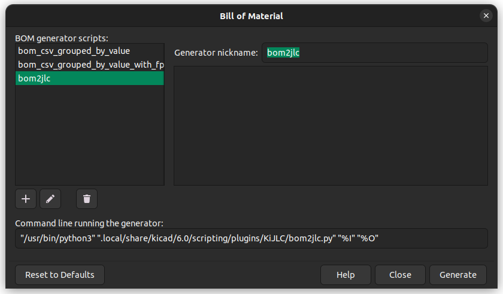

# KiJLC


An inofficial plugin for KiCad to export BOM and CPL files compliant with JLCSMT. We're not affiliated with JLC. Please double check your data as there might still be bugs.

## BOM Fields

Right now the BOM plugin expects three fields to be present: "JLC" which should contain the JLCSMT footprint specifier, "LCSC" which should contain the part number from LCSC, and "MPN" which if populated with "DNP" will remove the symbol from the BOM. 

Right now KiCad footprint specifiers are not being converted to JLC ones, but this could be implemented in the future.

## Windows Compatibility

Windows versions of KiCad before 6.0 were built with Python 2, which is not compatible with this plugin. This plugin requires KiCad >6.0 on Windows.

## Installation

Clone the repo to the plugins directory.

### Linux

```sh
cd ~/.local/share/kicad/6.0/scripting/plugins
git clone git@github.com:kyle-goodwin/KiJLC.git
```

### Windows

```
cd %USERPOFILE%\Documents\KiCad\6.0\scripting\plugins
git clone git@github.com:kyle-goodwin/KiJLC.git
```

### Schematic Editor

For Schematic Editor create a new BOM plugin entry under Tools->Generate Bill of Materials. Select `~.local/share/kicad/6.0/scripting/plugins/KiJLC/bom2jlc.py` if prompted for a Generator File.



#### Linux Command line

```sh
"/usr/bin/python3" ".local/share/kicad/6.0/scripting/plugins/KiJLC/bom2jlc.py" "%I" "%O"
```

#### Windows Command Line

```powershell
python "$env:USERPOFILE\Documents\KiCad\6.0\scripting\plugins\KiJLC\bom2jlc.py" "%I" "%O"
```

## Usage

### PCB Editor

Under Tools->External Plugins->Generate JLCSMT Placement Files
or via the button in the toolbar.

### Schematic Editor

In the same configuration dialog as in Installation, just press generate and it will produce two BOM CSV files.
